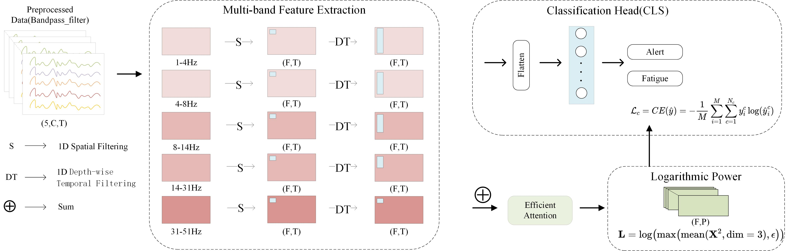

# MB-STFormer: A Multi-Band Spectral-Temporal Transformer with Efficient Attention for EEG-Based Fatigue Detection

## Architecture

## 

The model comprises four modules. (1)The multi-Band Feature Extraction module, which employs multi-scale convolutions, optimized for individual frequency bands, to extract spatial and temporal features. This approach preserves inter-band dynamics, enabling a comprehensive representation of EEG signals. (2) The Efficient Attention module, which adaptively balances fine-grained local details with global context to integrate the extracted multi-band features. (3) The LogPower module, which computes the logarithmic power of temporal features to enhance the stability and discriminability of neural representations by suppressing amplitude variance and highlighting oscillatory energy patterns across channels. (4) The Classifier module, which flattens and aggregates the hierarchical features into a low-dimensional representation and applies fully connected layers to output the predicted fatigue state.

## Development environment

ALL experiments were conducted on a Windows 10 system using PyCharm 1.8.0, with an AMD Ryzen 7 3700X CPU and an NVIDIA GeForce RTX 2080Ti GPU. The main following packages are required:

- [Python 3.9.0](https://www.python.org/downloads/release/python-390/)
- [Pytorch 2.0.1 + Pytorch Cuda 11.7](https://pytorch.org/get-started/previous-versions/#v201)

## Models

These models compared with MB-STFormer and unitized in the source code are listed below.

- [EEGNet](https://github.com/vlawhern/arl-eegmodels)
- [LGGNet](https://github.com/yi-ding-cs/LGG)
- [Deformer](https://github.com/yi-ding-cs/EEG-Deformer)
- [Conformer](https://github.com/eeyhsong/EEG-Conformer)
- [LMDA](https://github.com/MiaoZhengQing/LMDA-Code)

## Datasets

- [SADT](https://figshare.com/articles/dataset/Multi-channel_EEG_recordings_during_a_sustained-attention_driving_task/6427334)
- [SEED_VIG](https://bcmi.sjtu.edu.cn/~seed/seed-vig.html)
- [SEED_VLA](https://bcmi.sjtu.edu.cn/~seed/seed-VLA.html)

## Citation

If you find our work useful, please consider citing our paper:
